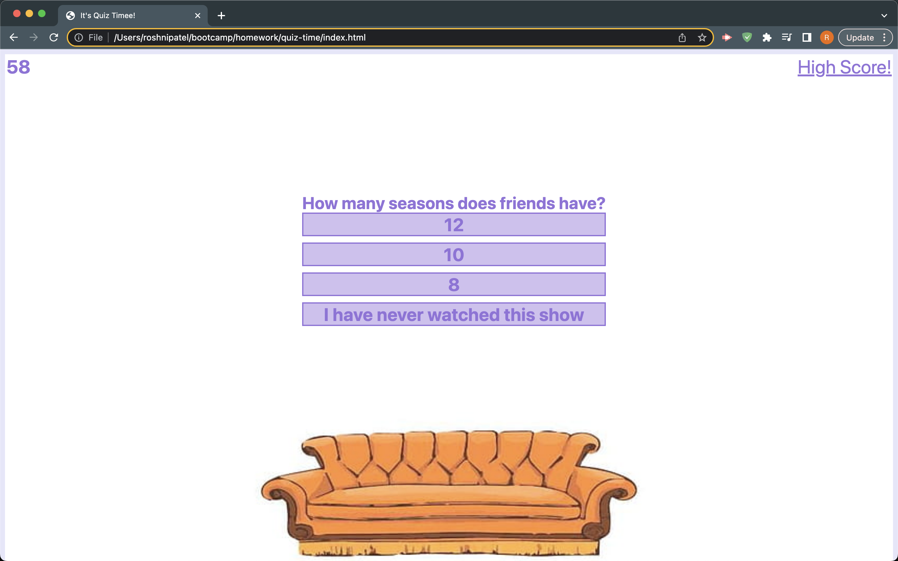

# Are you a true FRIENDS fan?

## Description

I have created a quiz about the show named 'Friends' which has been one of the most popular sitcom of all time. I built this quiz to sharpen up my JavaScript skills and incorporated many concepts such as: for loops, if statements, event listeners, and local storage. I also used HTML and CSS to bring some life to the quiz. 

## Usage

Navigate to the quiz page by clicking the link below and test your knowledge about the beloved show. You will have 60s to go through 6 questions, if you were to get an answer wrong then 10s will be deducted from your timer and if not then you shall go on to the next question without any penalty. By the end of this quiz, you will be taken to a page that tells you the number of questions you got right and you will be asked to put in your initials, after doing so your initials and score will be stored in highscores so you can go back and look at them as you please. 

## Links

Repository: https://github.com/roshniipatel/quiz-time 

Github Page: 

## Acknowledgements 

w3schools https://www.w3schools.com/

MDN Webdocs https://developer.mozilla.org/en-US/

James Q Quick https://www.youtube.com/c/jamesqquick 
